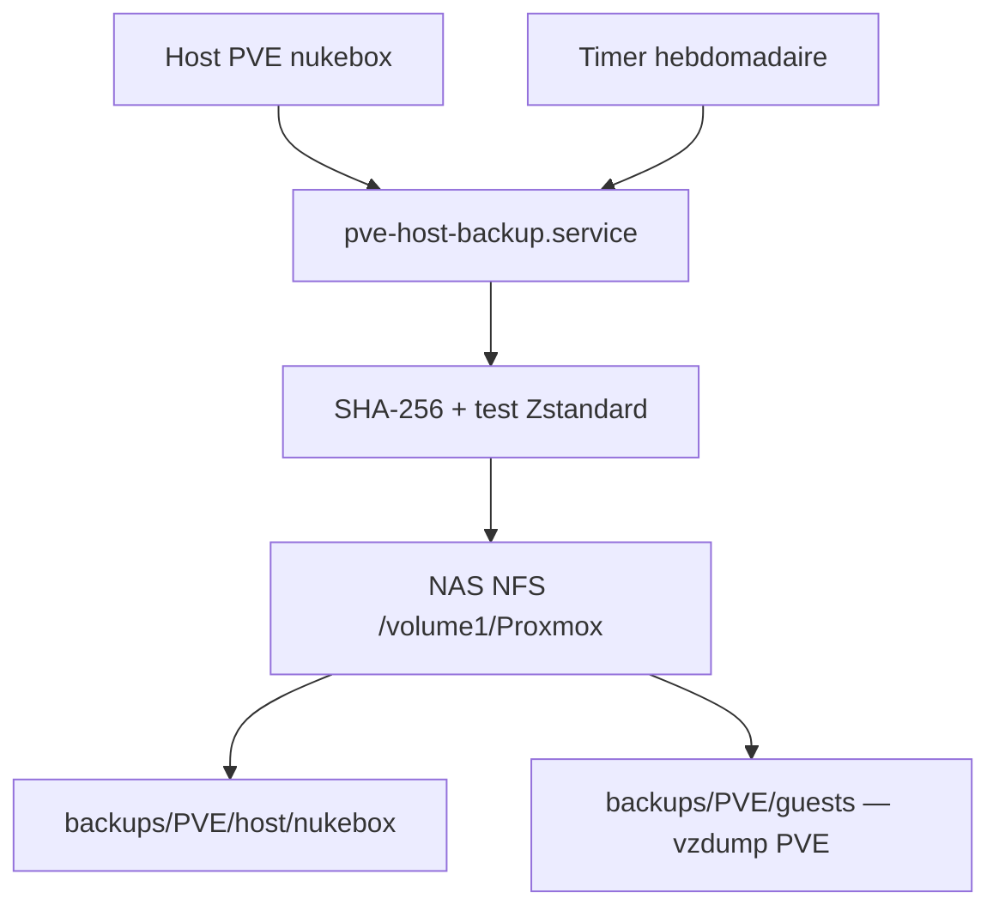

# Sauvegarde autonome du host Proxmox VE vers un NAS NFS

Ce dépôt installe une sauvegarde automatisée et vérifiée du **système du host
Proxmox VE** vers un NAS NFS. Il correspond à l’environnement suivant par
défaut :

| Élément | Valeur |
|---|---|
| Nœud PVE | `nukebox` |
| Stockage PVE NFS | `dreambox-backup` |
| Export Synology | `192.168.11.133:/volume1/Proxmox` |
| Dumps VM/CT déjà configurés | `backups/PVE/guests` |
| Sauvegardes du host | `backups/PVE/host/nukebox` |
| Rétention du host | 3 sauvegardes finalisées |
| Planification préparée | dimanche à 04:15, délai aléatoire de 0 à 15 min |

Les valeurs sont modifiables au moment de l’installation. Aucun serveur
Proxmox Backup Server n’est nécessaire pour lire ou restaurer ces archives.

> Ce projet est un script communautaire, pas une fonction officielle de
> Proxmox. `vzdump` sauvegarde les VM et CT ; ce dépôt complète ce dispositif
> pour le système du host.

## Ce que le dépôt fournit

- une archive du système PVE avec propriétaires, ACL et attributs étendus ;
- une archive distincte de `/etc/pve` ;
- une copie SQLite cohérente de `/var/lib/pve-cluster/config.db` ;
- les fichiers de démarrage `/boot` et `/boot/efi` lorsqu’ils sont sur des
  systèmes de fichiers séparés ;
- un inventaire du matériel, des disques, du réseau, du stockage PVE, des jobs
  et des guests ;
- des sommes SHA-256 et un test de chaque archive Zstandard ;
- une publication atomique : une sauvegarde incomplète n’est jamais présentée
  comme finalisée ;
- un timer systemd facile à activer et désactiver ;
- une extraction en zone de staging qui ne modifie pas le host ;
- un nettoyage sûr et une désinstallation conservant les backups du NAS.

Le script **ne sauvegarde pas** les disques des VM/CT, les ISO, les caches de
conteneurs, les montages externes, les journaux et les pseudo-systèmes de
fichiers. Les VM/CT restent couverts par vos jobs PVE `vzdump` existants.

## Architecture



Sur le Synology, l’arborescence obtenue est :

```text
/volume1/Proxmox/
└── backups/
    └── PVE/
        ├── guests/
        │   ├── vzdump-qemu-<VMID>-<DATE>.vma.zst
        │   └── vzdump-lxc-<CTID>-<DATE>.tar.zst
        └── host/
            └── nukebox/
                ├── LAST_RUN_STATUS.txt
                ├── LATEST.txt
                └── 2026-08-17T11-31-31Z/
                    ├── rootfs.tar.zst
                    ├── etc-pve.tar.zst
                    ├── boot-efi.tar.zst
                    ├── recovery.tar.zst
                    ├── SHA256SUMS
                    ├── MANIFEST.txt
                    ├── RESTORE_HOST_PVE.txt
                    ├── pve-host-backup
                    └── pve-host-backup.conf
```

Selon le partitionnement, `boot.tar.zst` ou `boot-efi.tar.zst` peut être absent.
C’est normal si le répertoire correspondant n’est pas un montage séparé.

Une description détaillée des inclusions et exclusions se trouve dans
[Architecture technique](docs/ARCHITECTURE.md).

## Prérequis

- exécuter les commandes en `root` sur le host PVE ;
- disposer d’un stockage NFS PVE actif ;
- disposer d’au moins 5 Gio libres par défaut ;
- vérifier que la source montée est bien celle attendue.

Contrôles adaptés à cet environnement :

```bash
pvesm status --storage dreambox-backup
findmnt -no SOURCE,TARGET,FSTYPE,OPTIONS /mnt/pve/dreambox-backup
```

La première commande doit afficher le stockage `active`. La seconde doit
montrer exactement `192.168.11.133:/volume1/Proxmox` et un type `nfs` ou
`nfs4`. Le programme refuse d’écrire si ces contrôles échouent afin de ne pas
remplir accidentellement le disque local.

## Installation sur `nukebox`

### Méthode A — cloner le dépôt

```bash
git clone <URL-DE-VOTRE-DEPOT> /var/tmp/pve-host-backup-repo
cd /var/tmp/pve-host-backup-repo
bash scripts/install.sh
```

Le dépôt peut être supprimé après installation : le programme, sa
configuration et ses unités systemd ont alors été copiés aux emplacements
appropriés.

### Méthode B — copier/coller, sans téléchargement dans `/root`

Ouvrir `scripts/install.sh` sur GitHub, copier tout son contenu, puis sur la
console PVE :

```bash
nano /var/tmp/install-pve-host-backup.sh
```

Coller le contenu, enregistrer avec `Ctrl+O`, valider avec Entrée, quitter avec
`Ctrl+X`, puis lancer :

```bash
bash /var/tmp/install-pve-host-backup.sh
rm -f /var/tmp/install-pve-host-backup.sh
```

Le fichier temporaire est supprimé ; aucun installateur n’est conservé dans
`/root`.

### Installation avec des valeurs différentes

Les paramètres peuvent être fournis comme variables d’environnement :

```bash
PVE_NFS_STORAGE='dreambox-backup' \
EXPECTED_NFS_SOURCE='192.168.11.133:/volume1/Proxmox' \
KEEP_BACKUPS='3' \
TIMER_CALENDAR='Sun *-*-* 04:15:00' \
TIMER_RANDOM_DELAY='15m' \
MAIL_TO='root' \
bash scripts/install.sh
```

Paramètres disponibles :

| Variable | Valeur par défaut | Rôle |
|---|---|---|
| `PVE_NFS_STORAGE` | `dreambox-backup` | identifiant du stockage dans PVE |
| `EXPECTED_NFS_SOURCE` | `192.168.11.133:/volume1/Proxmox` | source NFS exigée |
| `BACKUP_ROOT` | `<montage>/backups/PVE/host/<nœud>` | destination finale |
| `KEEP_BACKUPS` | `3` | dossiers finalisés à conserver |
| `MIN_FREE_KIB` | `5242880` | espace libre minimal, soit 5 Gio |
| `ZSTD_THREADS` | `2` | threads de compression |
| `TIMER_CALENDAR` | `Sun *-*-* 04:15:00` | calendrier systemd, heure du host |
| `TIMER_RANDOM_DELAY` | `15m` | délai aléatoire maximal |
| `STAGING_ROOT` | `/var/tmp/pve-host-restore` | extraction temporaire |
| `MAIL_TO` | `root` | destinataire remis au `sendmail` local |
| `OVERWRITE_CONFIG` | `0` | mettre à `1` pour remplacer une configuration existante |

L’installateur reste volontairement **désactivé après installation**. Il faut
d’abord réaliser et contrôler une sauvegarde manuelle.

## Mettre le programme à jour

Relancer la nouvelle version de `scripts/install.sh`. Par défaut, le fichier
`/etc/pve-host-backup.conf` existant est chargé et préservé. Les anciens
programme, configuration et unités sont copiés sous
`/usr/local/share/doc/pve-host-backup/` avec un horodatage.

```bash
bash scripts/install.sh
```

L’installation ou la mise à jour désactive le timer par sécurité. Refaire au
minimum `check`, une sauvegarde manuelle et `verify`, puis le réactiver.

Pour remplacer volontairement les valeurs existantes :

```bash
OVERWRITE_CONFIG=1 \
PVE_NFS_STORAGE='dreambox-backup' \
EXPECTED_NFS_SOURCE='192.168.11.133:/volume1/Proxmox' \
KEEP_BACKUPS='3' \
bash scripts/install.sh
```

Sans `OVERWRITE_CONFIG=1`, la configuration installée a priorité sur les
variables fournies pendant une mise à jour.

## Validation initiale obligatoire

### 1. Contrôler la configuration et l’écriture NFS

```bash
pve-host-backup check
```

### 2. Tester le système de notification local

```bash
pve-host-backup notify-test
```

Le message indique que `sendmail` local a accepté la notification. Cela ne
garantit pas sa livraison externe : l’adresse ou le relais mail de PVE doit
être configuré séparément.

### 3. Lancer une première sauvegarde

```bash
systemctl start --no-block pve-host-backup.service
journalctl -fu pve-host-backup.service
```

Quitter le suivi du journal avec `Ctrl+C` ; cela n’arrête pas la sauvegarde.
Le résultat attendu est `Finished pve-host-backup.service` sans erreur.

Contrôler ensuite :

```bash
systemctl status pve-host-backup.service --no-pager
pve-host-backup status
pve-host-backup verify latest
```

### 4. Tester l’extraction sans rien restaurer

```bash
pve-host-backup stage latest
```

Les archives sont extraites sous
`/var/tmp/pve-host-restore/<DATE>/`. Le système actif n’est pas modifié.
Après inspection :

```bash
pve-host-backup unstage latest
```

Une fois ces quatre étapes réussies, la chaîne sauvegarde–vérification–lecture
a été testée.

## Activer, désactiver et surveiller l’automatisation

Activer le timer :

```bash
pve-host-backup auto-on
```

Afficher son état et la prochaine exécution :

```bash
pve-host-backup auto-status
```

Désactiver la programmation :

```bash
pve-host-backup auto-off
```

`auto-off` désactive seulement les lancements futurs. Une sauvegarde déjà en
cours continue normalement, ce que la commande signale. Comme le timer utilise
`Persistent=true`, systemd peut lancer rapidement une occurrence qui aurait
été manquée pendant que le host était arrêté.

Commandes de suivi utiles :

```bash
journalctl -u pve-host-backup.service -n 100 --no-pager
journalctl -fu pve-host-backup.service
systemctl list-timers --all pve-host-backup.timer --no-pager
cat /mnt/pve/dreambox-backup/backups/PVE/host/nukebox/LAST_RUN_STATUS.txt
```

### Visibilité dans l’interface PVE

PVE n’enregistre pas ce script comme un job `vzdump`. Par conséquent :

- les archives du host ne sont pas listées dans l’onglet **Backups** du
  stockage ;
- le service personnalisé n’apparaît normalement pas dans
  **nukebox → System → Services** ; cette vue utilise une liste de services PVE
  prédéfinie ;
- modifier les fichiers internes de l’interface PVE pour l’ajouter serait
  fragile et serait écrasé par les mises à jour : ce dépôt ne le fait pas ;
- le suivi fiable se fait avec `pve-host-backup status`, le journal systemd,
  `LAST_RUN_STATUS.txt` sur le NAS et la notification locale.

Les jobs VM/CT existants restent, eux, visibles dans l’interface PVE.

## Toutes les commandes du programme

```text
pve-host-backup check
pve-host-backup run
pve-host-backup status
pve-host-backup verify [latest|DATE]
pve-host-backup stage [latest|DATE]
pve-host-backup unstage [latest|DATE]
pve-host-backup cleanup-partials
pve-host-backup manual
pve-host-backup notify-test
pve-host-backup auto-on
pve-host-backup auto-off
pve-host-backup auto-status
```

La date est le nom UTC du dossier, par exemple
`2026-08-17T11-31-31Z`.

## Rétention

Après une exécution entièrement validée, le programme conserve les
`KEEP_BACKUPS` dossiers finalisés les plus récents, soit 3 par défaut. Les
dossiers `.partial-*` ne comptent jamais comme sauvegardes valides et sont
supprimés après un échec ou via :

```bash
pve-host-backup cleanup-partials
```

Cette rétention est indépendante de celle des dumps VM/CT configurée dans PVE.

## Restauration

Le principe le plus sûr est toujours :

1. vérifier les sommes ;
2. extraire en staging ;
3. comparer ;
4. appliquer uniquement les fichiers nécessaires ;
5. conserver une copie `.before-restore` avant chaque remplacement.

```bash
pve-host-backup verify latest
pve-host-backup stage latest
```

Ne jamais exécuter une extraction de `rootfs.tar.zst` directement sur `/` d’un
host en fonctionnement. Pour une perte totale, réinstaller d’abord une version
majeure compatible de PVE avec le même nom de nœud, remonter le NFS, puis
restaurer sélectivement. Les VM/CT se restaurent ensuite depuis leurs dumps PVE
par l’interface ou avec `qmrestore`/`pct restore`.

La procédure complète, avec les scénarios de panne et les précautions autour
de `config.db`, est dans [Guide de restauration](docs/RESTORE.md).

## Nettoyer les essais

Le script suivant supprime uniquement :

- les extractions sous `/var/tmp/pve-host-restore` ;
- les temporaires locaux `pve-host-backup.*` ;
- les dossiers NFS `.partial-*` après validation de la source NFS.

Il conserve les sauvegardes finalisées, les fichiers d’état et les dumps
VM/CT :

```bash
bash scripts/cleanup-tests.sh
```

## Désinstallation propre

```bash
bash scripts/uninstall.sh
bash scripts/uninstall.sh --yes
```

Le premier appel affiche ce qui sera fait. Le second :

- désactive le timer ;
- refuse de continuer si une sauvegarde est active ;
- supprime le programme, sa configuration, ses unités et les stagings locaux ;
- supprime uniquement les dossiers NFS incomplets après validation du montage.

Il conserve les archives finalisées, `LATEST.txt`, `LAST_RUN_STATUS.txt`, les
dumps VM/CT, le stockage PVE et les paquets installés.

## Diagnostic

Consulter [Dépannage](docs/TROUBLESHOOTING.md) pour les erreurs de montage NFS,
d’espace disque, de timer, de notification, de somme de contrôle ou de
staging.

## Vérifier le dépôt avant publication

Depuis un poste Linux :

```bash
bash tests/validate.sh
```

Ce test contrôle la syntaxe des trois scripts, extrait le programme embarqué
dans l’installateur, valide sa syntaxe et vérifie les corrections concernant
`lxcfs` et Postfix. Il ne crée aucune sauvegarde.

## Mettre ce dossier sur GitHub

```bash
git init
git add .
git commit -m 'Initial release: PVE host backup 1.0.0'
git branch -M main
git remote add origin <URL-DE-VOTRE-DEPOT-GITHUB>
git push -u origin main
```

Avant de rendre le dépôt public, vérifier qu’aucun mot de passe, secret ou
token n’a été ajouté. Les adresses IP privées et les noms de stockage présents
ici ne sont pas des identifiants d’authentification, mais vous pouvez les
remplacer par des exemples si vous ne souhaitez pas publier votre topologie.

## Documentation de référence

Les choix techniques et les liens vers la documentation officielle Proxmox,
SQLite, GNU tar et systemd sont regroupés dans
[Références officielles](docs/OFFICIAL-REFERENCES.md).
