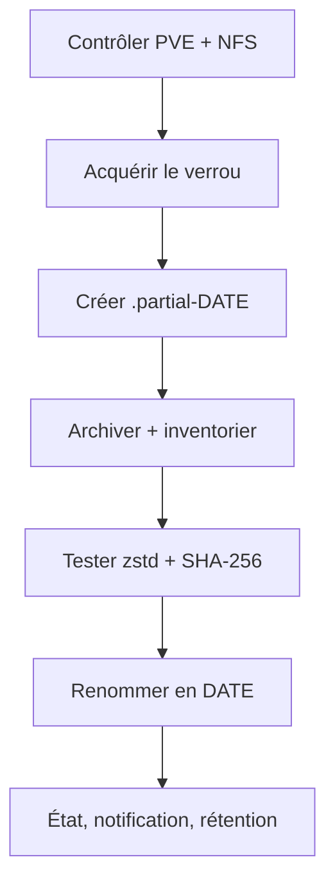

# Architecture technique

## Objectif et limites

Le projet complète les sauvegardes `vzdump` de Proxmox VE par une copie
autonome des fichiers et métadonnées du **host**. Les formats choisis,
`tar`, Zstandard, SQLite et SHA-256, restent lisibles sans PBS.

Ce n’est pas :

- une image bloc du disque système ;
- un snapshot LVM/ZFS ;
- un mécanisme bare-metal amorçable ;
- un job de backup natif affiché par PVE ;
- une sauvegarde des disques VM ou CT.

La restauration totale commence donc par une réinstallation de PVE, puis une
restauration sélective des fichiers du host.

## Flux d’une exécution

Le verrou `flock` empêche deux exécutions simultanées. Le dossier de travail
sur le NAS commence par `.partial-`. Il n’est renommé avec sa date définitive
qu’après les tests Zstandard et la création de `SHA256SUMS`. Un échec déclenche
sa suppression et inscrit un état `FAILURE` lorsqu’il est possible d’écrire
sur la destination vérifiée.

La rétention ne porte que sur les dossiers finalisés dont le nom respecte le
format UTC `YYYY-MM-DDTHH-MM-SSZ`. Elle intervient après la réussite de la
nouvelle sauvegarde.

## Vérification de la destination

Avant toute écriture, le programme :

1. demande à `pvesm` l’état du stockage ;
2. vérifie que `/mnt/pve/<stockage>` est un montage `nfs` ou `nfs4` ;
3. compare sa source à `EXPECTED_NFS_SOURCE` ;
4. refuse une destination en dehors de
   `<montage>/backups/PVE/host/<nœud>` ;
5. effectue un test d’écriture ;
6. contrôle l’espace libre minimal.

Cette barrière évite qu’une panne NFS transforme le point de montage en simple
répertoire local et remplisse le disque système.

## Contenu de chaque sauvegarde

| Fichier | Contenu | Utilité principale |
|---|---|---|
| `rootfs.tar.zst` | système de fichiers racine, avec exclusions | paquets, configuration Debian/PVE, scripts locaux |
| `etc-pve.tar.zst` | vue de `/etc/pve` fournie par pmxcfs | configurations PVE faciles à comparer |
| `boot.tar.zst` | `/boot` s’il est monté séparément | noyaux et chargeur |
| `boot-efi.tar.zst` | `/boot/efi` s’il est monté séparément | partition système EFI |
| `recovery.tar.zst` | base cohérente, inventaires et outils | diagnostic et reprise assistée |
| `SHA256SUMS` | somme de chaque fichier de premier niveau | détection d’altération |
| `MANIFEST.txt` | version, date, host et résultat SQLite | identification rapide |
| `RESTORE_HOST_PVE.txt` | aide de reprise embarquée | procédure disponible même sans GitHub |
| `pve-host-backup` | programme utilisé pour cette sauvegarde | vérification et staging sur un host réinstallé |
| `pve-host-backup.conf` | configuration utilisée | retrouver les chemins et paramètres |

### Copie de `/etc/pve` et de `config.db`

`/etc/pve` est exposé par **pmxcfs**, et non stocké comme un répertoire
classique. Le programme en conserve deux représentations complémentaires :

- `etc-pve.tar.zst` contient les fichiers tels qu’ils étaient visibles au
  moment de l’archive ;
- `recovery/critical/var/lib/pve-cluster/config.db` est créé avec la commande
  SQLite `.backup`, puis contrôlé avec `PRAGMA integrity_check`.

La première est pratique pour comparer ou récupérer un fichier précis. La
seconde fournit une copie transactionnellement cohérente de la base pmxcfs,
mais son remplacement complet reste une opération avancée.

### Inventaires enregistrés

Le dossier `recovery/inventory` contient notamment :

- versions PVE et paquets Debian ;
- stockages, jobs de sauvegarde, listes et configurations VM/CT ;
- adresses, routes, bridges et VLAN ;
- montages, partitions, UUID, LVM et ZFS ;
- périphériques PCI/USB ;
- état du boot Proxmox et EFI ;
- services activés et timers systemd.

Les commandes facultatives absentes du host sont consignées sans faire échouer
la sauvegarde.

## Exclusions du système racine

L’archive racine utilise `--one-file-system`. Les éléments suivants sont en
plus exclus intentionnellement :

| Catégorie | Exemples | Motif |
|---|---|---|
| pseudo-systèmes | `/dev`, `/proc`, `/sys`, `/run` | recréés au démarrage |
| temporaires | `/tmp`, `/var/tmp` | non nécessaires à une reprise |
| montages | `/mnt`, `/media` | éviter NAS et volumes externes |
| pmxcfs | `/etc/pve`, `/var/lib/pve-cluster` | archives dédiées et copie SQLite |
| données guests | images, volumes LXC, ISO, caches et dumps sous `/var/lib/vz` | couverts par les backups guests |
| données volatiles | caches, journaux, RRD | taille et cohérence |
| systèmes vivants | `/var/lib/lxcfs` | attributs non pris en charge et fichiers changeants |
| sockets mail | `/var/spool/postfix` | sockets impossibles à archiver utilement |

Ces deux dernières exclusions corrigent les erreurs observées avec `lxcfs` et
les sockets Postfix. Les fichiers de configuration Postfix situés sous `/etc`
restent, eux, couverts.

## Vérification et lecture

Avant finalisation :

- `zstd -t` teste chaque archive compressée ;
- `sha256sum` couvre toutes les archives et tous les fichiers d’aide ;
- SQLite contrôle sa copie de `config.db` ;
- `mv` publie le dossier finalisé sur le même système de fichiers NFS.

`pve-host-backup verify` répète les deux premiers contrôles. La commande
`stage` inspecte d’abord les noms contenus dans les archives : les chemins
absolus et les traversées `..` sont refusés. L’extraction se fait ensuite sous
`/var/tmp/pve-host-restore`, avec `--no-same-owner`, sans écriture dans le
système actif.

## Planification et charge

Le service est de type `oneshot`. Il utilise une priorité CPU et E/S réduite :

- `Nice=10` ;
- classe d’E/S `best-effort`, priorité 7 ;
- politique CPU `batch` ;
- deux threads Zstandard par défaut.

Le timer est hebdomadaire et persistant. Il s’exécute le dimanche à l’heure
locale choisie avec `pve-host-backup configure`. L’installateur le laisse
désactivé jusqu’à la réussite d’un test manuel.

Les échecs déclenchent toujours une notification contenant l’erreur détectée.
Les notifications de succès sont facultatives et désactivées par défaut.

## Confidentialité

Les archives ne sont pas chiffrées par ce projet. Elles peuvent contenir des
configurations réseau, clés SSH du host, certificats et autres informations
sensibles présentes dans le système. Les permissions sont restrictives, mais
la protection finale dépend également :

- des droits du partage Synology ;
- des règles NFS ;
- du réseau entre PVE et le NAS ;
- des snapshots/réplications éventuels du NAS ;
- d’une copie hors ligne ou hors site.

NFS classique ne chiffre pas automatiquement le trafic. Utiliser un réseau de
stockage de confiance et protéger l’accès SMB au dossier.
